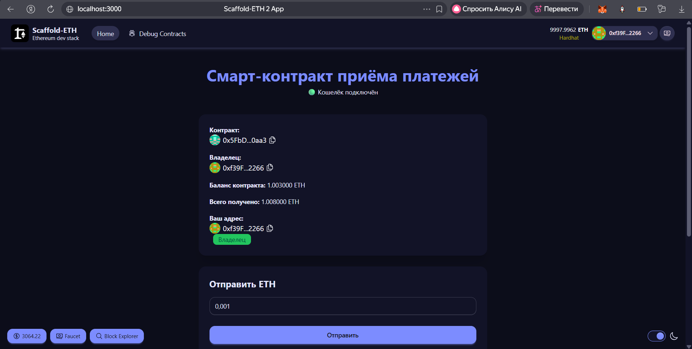
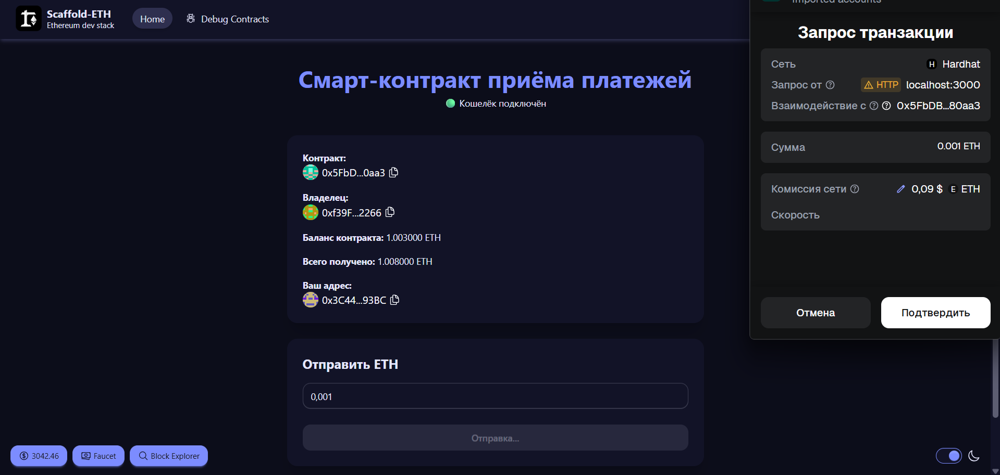
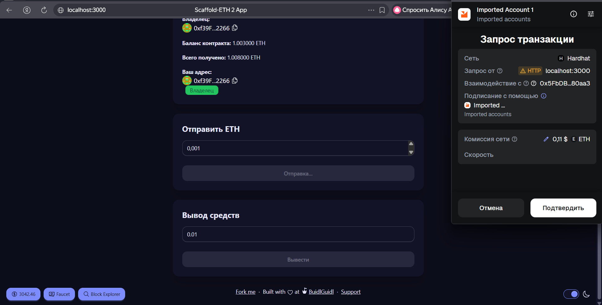

# 💸 Payment Smart Contract DApp

Децентрализованное приложение (dApp) для приёма ETH-платежей через смарт-контракт  
с возможностью вывода средств владельцем контракта.

Проект реализован на базе **Scaffold-ETH 2**, использует **Next.js**, **wagmi**, **ethers**  
и демонстрирует полный цикл взаимодействия фронтенда с блокчейном Ethereum.

---

## 🚀 Возможности

- ✅ Подключение кошелька (MetaMask)
- ✅ Отправка ETH напрямую в смарт-контракт
- ✅ Учёт баланса и общей суммы полученных средств
- ✅ Разграничение ролей (владелец / пользователь)
- ✅ Вывод средств **только владельцем**
- ✅ Проверка всех операций через Block Explorer
- ✅ Обработка ошибок (отмена транзакции, недостаток средств и т.д.)
- ✅ Тёмная тема интерфейса

---

## 🧱 Стек технологий

- **Solidity** — смарт-контракт
- **Hardhat** — локальная сеть и деплой
- **Scaffold-ETH 2**
- **Next.js (App Router)**
- **TypeScript**
- **wagmi / viem**
- **Tailwind CSS + DaisyUI**

---

## 📸 Скриншоты

### Главная страница


### Подключённый кошелёк и информация о контракте


### Отправка ETH в контракт


### Вывод средств владельцем



---

## 🛠 Установка и запуск (локально)

### 1️⃣ Клонировать репозиторий
```bash
git clone https://github.com/Sulaymonsuper/Project_Kurbanov.git
cd Project_Kurbanov
```
2️⃣ Установить зависимости
```bash
yarn install
```
3️⃣ Запустить локальный блокчейн
```bash
yarn chain
```
Hardhat запустится на:

```text
http://127.0.0.1:8545
```
4️⃣ Деплой смарт-контракта
В новом терминале:

```bash
yarn deploy
```
После деплоя контракт будет доступен в локальной сети.

5️⃣ Запуск фронтенда
```bash
yarn start
```
Открыть в браузере:

text
http://localhost:3000

🧪 Как продемонстрировать работоспособность
🔌 Подключение кошелька
Подключите MetaMask

Используйте Hardhat account (автоматически содержит ETH)

💸 Отправка платежа
Введите сумму ETH (например 0.001)

Нажмите Отправить

Подтвердите транзакцию в MetaMask

Убедитесь, что:

баланс контракта увеличился

вырос параметр Всего получено

🔍 Проверка в Block Explorer
Нажмите на hash транзакции

Проверьте:

from → to (контракт)

value

статус Success

👑 Вывод средств (только владелец)
Подключитесь кошельком владельца

Появится форма Вывод средств

Укажите сумму

Подтвердите транзакцию

⚠️ Попытка вывода с другого адреса завершится ошибкой

🔐 Логика доступа
Действие	Пользователь	Владелец
Отправка ETH	✅	✅
Просмотр баланса	✅	✅
Вывод средств	❌	✅
Проверка прав выполняется на уровне смарт-контракта, а не фронтенда.

📂 Структура проекта
```text
packages/
 ├── hardhat/        # Solidity контракты
 └── nextjs/         # Frontend (Next.js)
     ├── app/
     ├── components/
     ├── styles/
```
📌 Назначение проекта
Проект создан в учебных и демонстрационных целях и показывает:

реальное взаимодействие Web UI ↔ Blockchain

работу с ETH-платежами

базовую архитектуру Web3 dApp

Может использоваться как:

портфолио Web3-разработчика

шаблон для платёжных dApp

основа для приёма донатов / оплат

👤 Автор
Сулаймон Курбанов

GitHub: https://github.com/Sulaymonsuper

📄 Лицензия
```MIT

text

## 📌 Что нужно сделать сейчас:

1. **Создай папку `screenshots`:**
```bash
mkdir screenshots
```
```


# 🏗 Scaffold-ETH 2

<h4 align="center">
  <a href="https://docs.scaffoldeth.io">Documentation</a> |
  <a href="https://scaffoldeth.io">Website</a>
</h4>

🧪 An open-source, up-to-date toolkit for building decentralized applications (dapps) on the Ethereum blockchain. It's designed to make it easier for developers to create and deploy smart contracts and build user interfaces that interact with those contracts.

⚙️ Built using NextJS, RainbowKit, Foundry/Hardhat, Wagmi, Viem, and Typescript.

- ✅ **Contract Hot Reload**: Your frontend auto-adapts to your smart contract as you edit it.
- 🪝 **[Custom hooks](https://docs.scaffoldeth.io/hooks/)**: Collection of React hooks wrapper around [wagmi](https://wagmi.sh/) to simplify interactions with smart contracts with typescript autocompletion.
- 🧱 [**Components**](https://docs.scaffoldeth.io/components/): Collection of common web3 components to quickly build your frontend.
- 🔥 **Burner Wallet & Local Faucet**: Quickly test your application with a burner wallet and local faucet.
- 🔐 **Integration with Wallet Providers**: Connect to different wallet providers and interact with the Ethereum network.


## Requirements

Before you begin, you need to install the following tools:

- [Node (>= v20.18.3)](https://nodejs.org/en/download/)
- Yarn ([v1](https://classic.yarnpkg.com/en/docs/install/) or [v2+](https://yarnpkg.com/getting-started/install))
- [Git](https://git-scm.com/downloads)

## Quickstart

To get started with Scaffold-ETH 2, follow the steps below:

1. Install the latest version of Scaffold-ETH 2

```
npx create-eth@latest
```

This command will install all the necessary packages and dependencies, so it might take a while.

> [!NOTE]
> You can also initialize your project with one of our extensions to add specific features or starter-kits. Learn more in our [extensions documentation](https://docs.scaffoldeth.io/extensions/).

2. Run a local network in the first terminal:

```
yarn chain
```

This command starts a local Ethereum network that runs on your local machine and can be used for testing and development. Learn how to [customize your network configuration](https://docs.scaffoldeth.io/quick-start/environment#1-initialize-a-local-blockchain).

3. On a second terminal, deploy the test contract:

```
yarn deploy
```

This command deploys a test smart contract to the local network. You can find more information about how to customize your contract and deployment script in our [documentation](https://docs.scaffoldeth.io/quick-start/environment#2-deploy-your-smart-contract).

4. On a third terminal, start your NextJS app:

```
yarn start
```

Visit your app on: `http://localhost:3000`. You can interact with your smart contract using the `Debug Contracts` page. You can tweak the app config in `packages/nextjs/scaffold.config.ts`.

**What's next**:

Visit the [What's next section of our docs](https://docs.scaffoldeth.io/quick-start/environment#whats-next) to learn how to:

- Edit your smart contracts
- Edit your deployment scripts
- Customize your frontend
- Edit the app config
- Writing and running tests
- [Setting up external services and API keys](https://docs.scaffoldeth.io/deploying/deploy-smart-contracts#configuration-of-third-party-services-for-production-grade-apps)

## Documentation

Visit our [docs](https://docs.scaffoldeth.io) to learn all the technical details and guides of Scaffold-ETH 2.

To know more about its features, check out our [website](https://scaffoldeth.io).

## Contributing to Scaffold-ETH 2

We welcome contributions to Scaffold-ETH 2!

Please see [CONTRIBUTING.MD](https://github.com/scaffold-eth/scaffold-eth-2/blob/main/CONTRIBUTING.md) for more information and guidelines for contributing to Scaffold-ETH 2.
